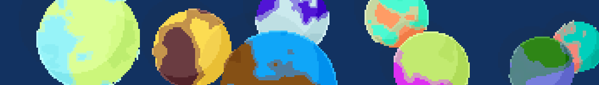

A few times ago I came across an area of digital arts called _generative design_. Behind this concept lies a simple idea: chaos under control. In this post — which will serve as an introduction — I'll talk about a funny little project I did called [Tiny Planets](https://supermayo.github.io/tinyPlanets/).

$$
L = \frac{1}{2} \rho v^2 S C_L
$$

